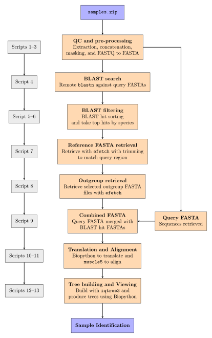

# Heathrow "Mystery Meat" analysis pipeline  
This analysis takes unknown raw FASTQ files and produces species identifications and a final phylogenetic tree in order to identify sample species through a fully automated and reproducible pipeline.

## Requirements  
- `micromamba` installation  (see: https://mamba.readthedocs.io/en/latest/installation/micromamba-installation.html)

```bash
"${SHELL}" <(curl -L micro.mamba.pm/install.sh)
```

- NCBI taxonomy dump is required for `taxonkit` in script 5 (see: https://ftp.ncbi.nlm.nih.gov/pub/taxonomy/). Please download and extract with the following before running:

```bash
mkdir -p ~/.taxonkit

# download latest NCBI taxonomy dump
wget ftp://ftp.ncbi.nih.gov/pub/taxonomy/taxdump.tar.gz

# extract
tar -xzf taxdump.tar.gz

# move files
mv *.dmp *.prt readme.txt ~/.taxonkit/
```
## Pipeline overview

| |
|:--:|
|  |

```
BIOLM0051_analysis
├── data
├── environment.yml
├── LaTeX
├── notes.md
├── README.md
├── report
├── results
└── scripts
```
# Step 1: Setting up the pipeline environment
Creating and activating the `micromamba` environment is recommended to ensure reproducibility

```bash
# clone this repo and navigate into project root
git clone git@github.com:archiebenn/BIOLM0051_analysis.git
cd BIOLM0051_analysis

# create project environment
micromamba create -n mystery-meat-env -f environment.yml

# activate project environment
micromamba activate mystery-meat-env
```

Ensure all scripts are executable:
```
chmod +x scripts/*
```

# Step 2: Running the scripts  
> [!IMPORTANT]
> Please run all scripts from the project root.

## Script Table
Overview of script numbers and steps involved  
| Script number | Step                | Script Description                               |
|---------------|---------------------|--------------------------------------------------|
| 1             | FASTQ check         | Checks input FASTQ file formats                  |
| 2             | Concatenate FASTQ   | Combine split FASTQ parts                        |
| 3             | FASTQ -> FASTA      | FASTQC and uses `seqtk` to convert to FASTA      |
| 4             | BLAST search        | Carries out remote `blastn` searches             |
| 5             | BLAST taxonomies    | Converts back to parts and attaches `taxonkit`   |
| 6             | Manual Selection    | Selects BLAST hits based on manual filters       |
| 7             | efetch              | Uses `efetch` to collect BLAST FASTA sequences   |
| 8             | Retrieve Outgroup   | Uses `efetch` to retrieve chosen outgroup FASTAs |
| 9             | Concatenate FASTA   | Joins original query FASTAs to `efetch` FASTAs   |
| 10            | Python translation  | Biopython script to translate to protein seqs    |
| 11            | Alignment           | Uses `muscle5` to align protein sequences        |
| 12            | Tree Build          | Uses `iqtree3` to build phylogenetic tree        |
| 13            | Tree View           | Visualise and root tree using Python             |

## Option A - Run Full Pipeline
Execute all scripts in the correct order for this pipeline: 

```bash
./scripts/pipeline.sh
```

Example run:

```
./scripts/pipeline.sh 

    __  _____  _____________________  __    __  __________ ______    ___   _  _____   ____  ______________
   /  |/  /\ \/ / __/_  __/ __/ _ \ \/ /   /  |/  / __/ _ /_  __/   / _ | / |/ / _ | / /\ \/ / __/  _/ __/
  / /|_/ /  \  /\ \  / / / _// , _/\  /   / /|_/ / _// __ |/ /     / __ |/    / __ |/ /__\  /\ \_/ /_\ \  
 /_/  /_/   /_/___/ /_/ /___/_/|_| /_/   /_/  /_/___/_/ |_/_/     /_/ |_/_/|_/_/ |_/____//_/___/___/___/  
========================================================================================================  
                                                                                                                                                                                                         
[1] FASTQ check beginning...
[1] FASTQ check complete

[2] FASTQ concatenation beginning...
Concatenating sampleA files...
Concatenating sampleB files...
.
.
.
[13] Rooted tree PDF created. Please find the phylogenetic tree pdf in results/13_tree_pdfs

Pipeline finished succesfully
Analysis runtime: 00h:23m:05s 
```

## Option B - Run pipeline from a specific script -> end
Allows skipping slow steps of the pipeline which can lead to significantly shorter run times:  

```bash
./scripts/pipeline.sh <script-number>
```

For example starting from script 5 (after BLAST search which can take > 20 minutes): 
```
./scripts/pipeline.sh 5

    __  _____  _____________________  __    __  __________ ______    ___   _  _____   ____  ______________
   /  |/  /\ \/ / __/_  __/ __/ _ \ \/ /   /  |/  / __/ _ /_  __/   / _ | / |/ / _ | / /\ \/ / __/  _/ __/
  / /|_/ /  \  /\ \  / / / _// , _/\  /   / /|_/ / _// __ |/ /     / __ |/    / __ |/ /__\  /\ \_/ /_\ \  
 /_/  /_/   /_/___/ /_/ /___/_/|_| /_/   /_/  /_/___/_/ |_/_/     /_/ |_/_/|_/_/ |_/____//_/___/___/___/  
========================================================================================================  

[5] Filtering BLAST hits...
Splitting sampleA back into parts, sorting by staxid, adding taxonomic lineages, and manually selecting BLAST hits.
Splitting sampleB back into parts, sorting by staxid, adding taxonomic lineages, and manually selecting BLAST hits.
.
.
.
[13] Rooted tree PDF created. Please find the phylogenetic tree pdf in results/13_tree_pdfs

Pipeline finished succesfully
Analysis runtime: 00h:06m:22s 
```

Please note this is only possible as a complete `results/` folder is included here on GitHub - if without `results/` the full pipeline must be run (option A).


# Step 3: Viewing Results
All pipeline results are stored in the `results/` folder. This contains sub-directories number-linked to the respective scripts where the results were generated.

`results/` general structure: 
```
results
├── 1_FASTQ_check
├── 2_FASTQ_processed
├── 3_FASTA_Q20
├── 3_FASTA_raw
├── 3_FASTQC_reports
├── 4_blast_outputs
├── 5_blast_filtering
├── 6_blast_selected
├── 7_efetch_FASTA
├── 7_outgroup_blasts
├── 8_outgroup_FASTA
├── 9_complete_FASTA
├── 10_protein_FASTA
├── 11_alignment_files
├── 11_supermatrix_files
├── 12_tree_files
├── 12_tree_outputs
└── 13_tree_pdfs
```
