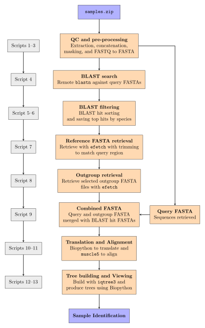

# Heathrow "Mystery Meat" analysis pipeline  
This analysis uses raw FASTQ files of unidentified meat DNA sequences, provided in `data/` as `samples.zip`, and produces a final phylogenetic tree in order to identify sample species through a fully automated and reproducible pipeline. The main steps involved in this are shown in the pipeline figure below. Typical pipeline runtime is 20-35 minutes depending on BLAST connection.

## OS Compatability 
- Tested on Linux (Ubuntu 24.04).
- Expected to work on macOS and other linux distributions, but untested.
- Not supported or tested on Windows 

## Requirements  
- `micromamba` installation  (see: https://mamba.readthedocs.io/en/latest/installation/micromamba-installation.html). To install, run:

```bash
"${SHELL}" <(curl -L micro.mamba.pm/install.sh)
```

- NCBI taxonomy dump is required for `taxonkit` in script 5 (see: https://ftp.ncbi.nlm.nih.gov/pub/taxonomy/). Please download and extract with the following before running:

```bash
mkdir -p ~/.taxonkit

# download latest NCBI taxonomy dump (macOS users may need to use curl or install wget)
wget ftp://ftp.ncbi.nih.gov/pub/taxonomy/taxdump.tar.gz

# extract
tar -xzf taxdump.tar.gz

# move files
mv *.dmp *.prt readme.txt ~/.taxonkit/
```
## Pipeline overview
This pipeline consists of 13 scripts and is designed to run using just the original `samples.zip` file placed in `data/` all the way through to the creation of the final phylogenetic tree using a single terminal prompt.   

The following figure gives an outline of the workflow this pipeline follows along with the script numbers which correspond to each step on the left hand side. A table with more explicit script numbering is also given below which is helpful if running the pipeline using `./scripts/pipeline.sh <script-number>` (see step 2B for more details on this).  

  


| Script number | Step                | Script Description                               |
|---------------|---------------------|--------------------------------------------------|
| 1             | FASTQ check         | Extracts and checks input FASTQ file formats     |
| 2             | Concatenate FASTQ   | Combine split FASTQ parts                        |
| 3             | FASTQ -> FASTA      | `seqtk` to convert to FASTA and mask             |
| 4             | BLAST search        | Carries out remote `blastn` searches             |
| 5             | BLAST taxonomies    | Converts back to parts and attaches `taxonkit`   |
| 6             | BLAST sorting       | Sorts and selects BLAST hits                     |
| 7             | efetch              | Uses `efetch` to collect BLAST FASTA sequences   |
| 8             | Retrieve Outgroup   | Uses `efetch` to retrieve chosen outgroup FASTAs |
| 9             | Concatenate FASTA   | Joins original query FASTAs to `efetch` FASTAs   |
| 10            | Python translation  | Biopython script to translate to protein seqs    |
| 11            | Alignment           | Uses `muscle5` to align protein sequences        |
| 12            | Tree Build          | Uses `iqtree3` to build phylogenetic tree        |
| 13            | Tree View           | Visualise and root tree using `ete3` and Python  |  

Along with these scripts, an additional exploratory script (`99_reduce_branch_sampleD.sh`) can be found in `scripts` and run to reproduce the exploration mentioned in the report discussion, but does not form part of the main pipeline. 

# Step 1: Setting up the pipeline environment
Creating and activating the `micromamba` environment is recommended to ensure reproducibility

```bash
# clone this repo and navigate into project root
git clone https://github.com/archiebenn/BIOLM0051_analysis.git
cd BIOLM0051_analysis

# create project environment
micromamba create -n mystery-meat-env -f environment.yml

# activate project environment
micromamba activate mystery-meat-env
```
> [!IMPORTANT]
> Ensure all scripts are executable:
> 
```
chmod +x scripts/*
```

# Step 2: Running the scripts  
> [!IMPORTANT]
> Please run all scripts from the project root.
> 
## Option A - Run Full Pipeline
Execute all scripts in the correct order for this pipeline: 

```bash
./scripts/pipeline.sh
```

Example run:

```
./scripts/pipeline.sh 

    __  _____  _____________________  __    __  __________ ______    ___   _  _____   ____  ______________
   /  |/  /\ \/ / __/_  __/ __/ _ \ \/ /   /  |/  / __/ _ /_  __/   / _ | / |/ / _ | / /\ \/ / __/  _/ __/
  / /|_/ /  \  /\ \  / / / _// , _/\  /   / /|_/ / _// __ |/ /     / __ |/    / __ |/ /__\  /\ \_/ /_\ \  
 /_/  /_/   /_/___/ /_/ /___/_/|_| /_/   /_/  /_/___/_/ |_/_/     /_/ |_/_/|_/_/ |_/____//_/___/___/___/  
========================================================================================================  
                                                                                                                                                                                                         
[1] FASTQ check beginning...
[1] FASTQ check complete

[2] FASTQ concatenation beginning...
Concatenating sampleA files...
Concatenating sampleB files...
.
.
.
[13] Rooted tree plot created - see terminal version above! Please find the full tree pdf in results/13_tree_plots

Pipeline finished successfully
Analysis runtime: 00h:23m:05s 
```

## Option B - Run pipeline from a specific script -> end
Allows skipping slow steps of the pipeline which can lead to significantly shorter run times:  

```bash
./scripts/pipeline.sh <script number>
```

For example starting from script 5 (after BLAST search which can take > 20 minutes): 
```
./scripts/pipeline.sh 5

    __  _____  _____________________  __    __  __________ ______    ___   _  _____   ____  ______________
   /  |/  /\ \/ / __/_  __/ __/ _ \ \/ /   /  |/  / __/ _ /_  __/   / _ | / |/ / _ | / /\ \/ / __/  _/ __/
  / /|_/ /  \  /\ \  / / / _// , _/\  /   / /|_/ / _// __ |/ /     / __ |/    / __ |/ /__\  /\ \_/ /_\ \  
 /_/  /_/   /_/___/ /_/ /___/_/|_| /_/   /_/  /_/___/_/ |_/_/     /_/ |_/_/|_/_/ |_/____//_/___/___/___/  
========================================================================================================  

[5] Filtering BLAST hits...
Splitting sampleA back into parts, sorting by staxid, adding taxonomic lineages, and manually selecting BLAST hits.
Splitting sampleB back into parts, sorting by staxid, adding taxonomic lineages, and manually selecting BLAST hits.
.
.
.
[13] Rooted tree plot created - see terminal version above! Please find the full tree pdf in results/13_tree_plots

Pipeline finished successfully
Analysis runtime: 00h:06m:22s 
```

Please note this is only possible as a complete `results/` folder is included here on GitHub - if without `results/` the full pipeline must be run (option A).


# Step 3: Viewing Results
All pipeline results are stored in the `results/` folder. This contains sub-directories number-linked to the respective scripts where the results were generated. All intermediate files generated from the pipeline can be found here, as well as the final tree. 

`results/` structure: 
```
├── results
│   ├── 1_checked_FASTQ
│   ├── 2_FASTQ_processed
│   ├── 3_FASTA_Q20
│   ├── 3_FASTA_raw
│   ├── 4_blast_outputs
│   ├── 5_blast_filtering
│   ├── 6_blast_selected
│   ├── 7_efetch_FASTA
│   ├── 8_outgroup_FASTA
│   ├── 9_complete_FASTA
│   ├── 10_protein_FASTA
│   ├── 11_alignment_files
│   ├── 11_supermatrix_files
│   ├── 12_tree_files
│   ├── 12_tree_outputs
│   ├── 13_tree_plots
|   └── 99_needleman_wunsch
```
The final tree pdf can be found in `13_tree_plots/`
